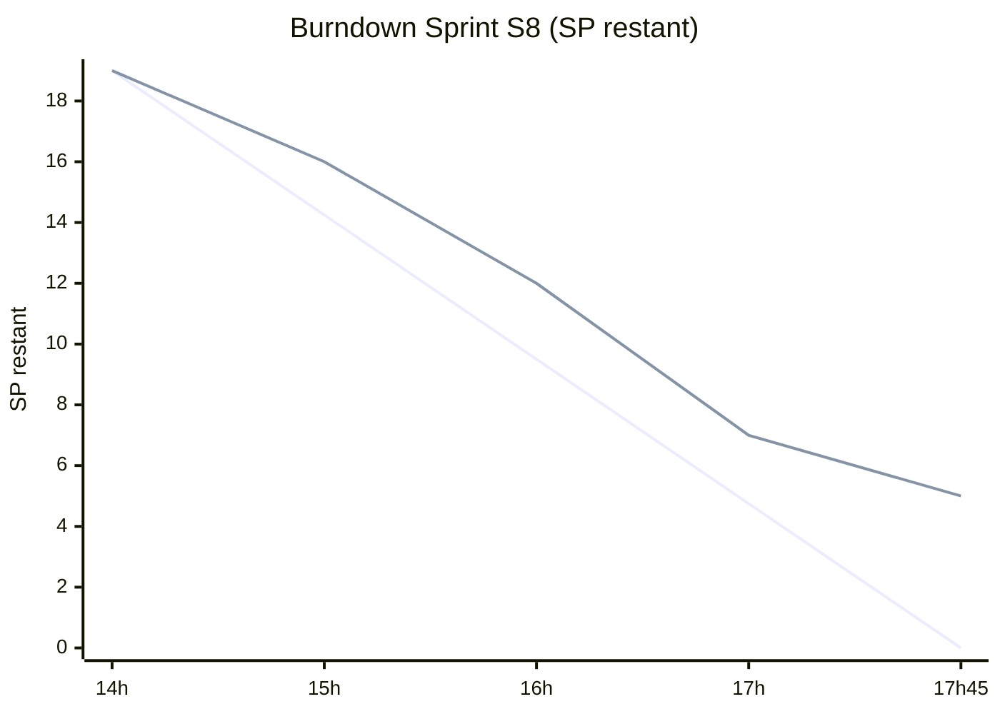
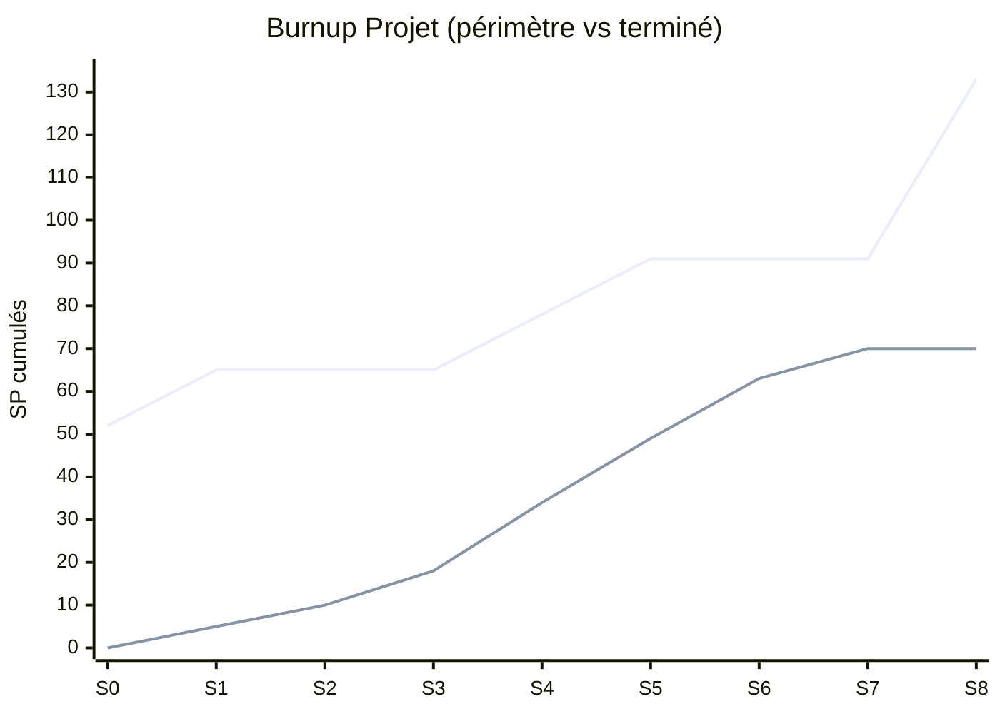

# J4 — Pilotage : Burndown & Burnup

> **Projet :** EduTutor IA · **Équipe :** Équipe 10 · **Perturbation :** J4
> Couvre **CA-J4-7** : burndown du **sprint en cours (S8)** + burnup du **projet**, montrant
> l'impact des perturbations sur le périmètre et la date de fin.
>
> Les graphiques Mermaid se rendent sur GitHub ; les tableaux servent de source de données et de secours.

---

## 1. Rappel du périmètre (points de story)

| Bloc | Stories | SP |
|------|---------|----|
| R1 cœur étudiant | US-01 → US-07 | 31 |
| R1 enseignant (J1) | US-08 → US-10 | 13 |
| R1 sécurité (J3) | US-14 → US-16 | 13 |
| R1 RGPD / SAR (J3-bis) | US-17 → US-20 | 13 |
| R2 initiale | US-11 → US-13 | 21 |
| **J4 (3 axes + risques)** | **US-21 → US-26** | **42** |
| **Total projet après J4** | | **133** |

---

## 2. Burndown — Sprint en cours (S8)

Sprint S8 = **19 SP** (US-21 : 8 + US-22 : 8 + US-26 : 3). Une demi-journée découpée en créneaux.

| Point de contrôle | Idéal (SP restant) | Réel (SP restant) |
|-------------------|--------------------|-------------------|
| Début (14h00) | 19 | 19 |
| 15h00 | 14.25 | 16 |
| 16h00 | 9.5 | 12 |
| 17h00 | 4.75 | 7 |
| Fin (17h45) | 0 | 5 |

**Lecture :** la courbe réelle reste **au-dessus** de l'idéale → le sprint finit avec **5 SP non
terminés** (finitions RGAA plus longues que prévu). Ces 5 SP sont **reportés au sprint suivant**.
Effet typique d'une perturbation tardive : la charge ajoutée ne rentre pas entièrement dans la
demi-journée disponible.

---

## 3. Burnup — Projet (impact des perturbations)

Deux courbes : **périmètre total** (monte en marches à chaque perturbation) et **travail terminé** (cumul).

| Sprint | Événement | Périmètre total (SP) | Terminé cumulé (SP) |
|--------|-----------|----------------------|---------------------|
| S0 | Cadrage (R1 cœur 31 + R2 21) | 52 | 0 |
| S1 | **J1** : suivi enseignant (+13) | 65 | 5 |
| S2 | | 65 | 10 |
| S3 | | 65 | 18 |
| S4 | **J3** : sécurité prompt injection (+13) | 78 | 34 |
| S5 | **J3-bis** : RGPD / export SAR (+13) | 91 | 49 |
| S6 | | 91 | 63 |
| S7 | R1 (F1-F6 + J1 + J3 + J3-bis) terminé | 91 | 70 |
| S8 | **J4** : 3 axes + risques (+42) | **133** | 70 |

**Lecture :**
- Le **périmètre monte par paliers** à chaque perturbation (J1 en S1, J3 en S4, J3-bis en S5) puis
  fait un **saut massif à S8** avec J4 (+42 SP) : le succès national fait plus que doubler le reste à faire.
- Le **terminé** progresse à une vélocité ~7-9 SP/sprint et atteint 70 SP (R1 livrée) à S7.
- À S8, il reste **133 − 70 = 63 SP** → au rythme actuel, la R2 *complète* glisse de ~8 demi-journées
  au-delà de la semaine. D'où la **repriorisation MoSCoW** : livrer d'abord les MUST (a11y + scale +
  non-régression), repousser flashcards/résumé/questions ouvertes.

---

## 4. Décision de pilotage tirée des courbes

1. **La date de fin de la R2 complète glisse** : impossible d'absorber 42 SP en une demi-journée.
2. On **fige une R2 candidate** (MUST) pour le tag `v1.1.0` et on **repousse** le reste
   (voir `doc_livrable/Jeudi/Artefact_6_Release_Planning_V4_J4.xlsx`).
3. Les **5 SP non terminés** du sprint S8 (burndown) et le **reste à faire** (burnup) alimentent
   directement le sprint suivant → boucle de pilotage cohérente.
